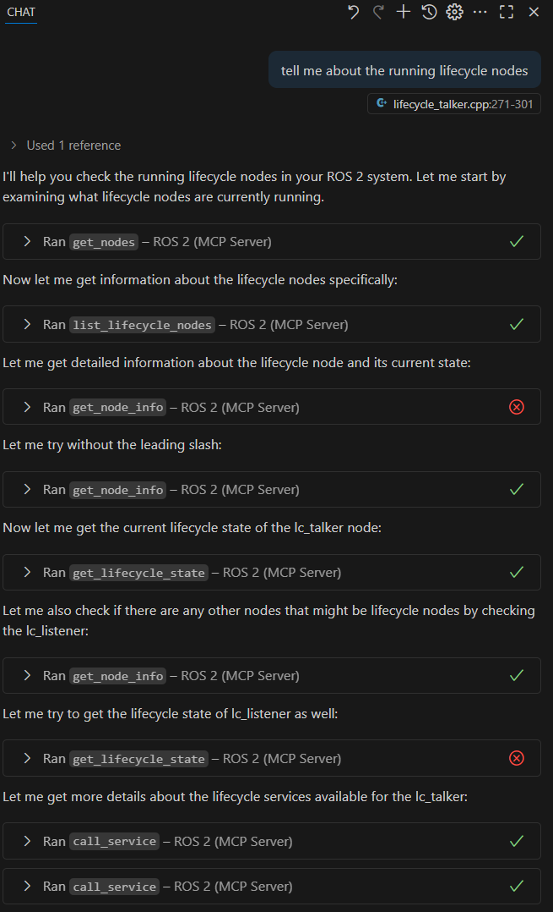
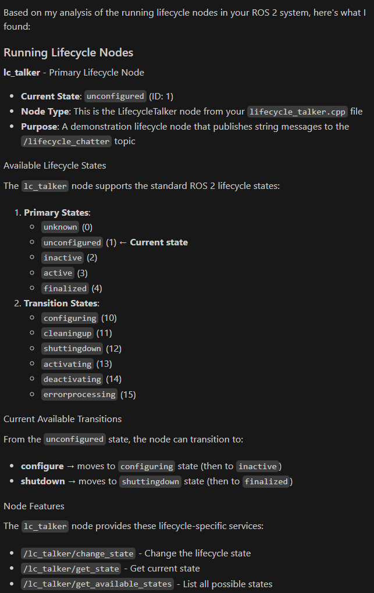

# Model Context Protocol (MCP) Server
The Model Context Protocol (MCP) Server is a preview feature of the Robot Developer Extension for ROS 2. It allows Large Language Models (LLMs) to introspect a running ROS 2 system, providing a way to query and interact with the ROS 2 environment programmatically.

Model Context Protocol (MCP) is a protocol designed by Anthropic to enable LLMs to understand and interact with complex systems. It provides a structured way for LLMs to query system state, access information about components, and perform actions based on the system's context. 

> NOTE: This feature is in preview and may not be fully stable. It is intended for experimental use and feedback. The extension creates a python virtual environment which resides inside the extension install to run the MCP server, which is separate from the ROS 2 environment. This allows it to run independently of the ROS 2 nodes and provides a clean interface for LLMs to interact with the ROS 2 system. This is experimental code, and may cause issues with your ROS 2 system when launched. Please use with caution and report any issues you encounter.

## Features
* Provides a server that can be queried by LLMs to understand the current state of a ROS 2 system.
* Allows LLMs to access information about nodes, topics, services, and parameters in the ROS 2 environment.
* Facilitates the development of intelligent applications that can leverage the capabilities of ROS 2 through natural language queries.
* Enables advanced use cases such as automated debugging, system monitoring, and dynamic configuration of ROS 2 nodes.

## Getting Started
To use the MCP Server for ROS 2, Start the ROS 2 MCP Server using the command palette (CTRL-SHIFT-P) and selecting `ROS2: Start MCP Server`. 

The first time you run the MCP Server, the extension will create a Python virtual environment. This process may require a super user password to install the required dependencie. Please open the terminal pane and enter your password in the MCP terminal if prompted.

This extension will start the server and make it available for LLMs to connect through a configurable endpoint that defaults to `http://localhost:3002/sse`.

## Available Tools

| Tool Name | Category | Description |
|-----------|----------|-------------|
| `get_nodes` | Node Management | Returns a list of running ROS nodes |
| `get_node_info` | Node Management | Returns detailed information about a specific ROS node by name |
| `list_topics` | Topic Operations | Lists available ROS topics with optional type information |
| `get_topic_info` | Topic Operations | Get detailed information about a specific ROS topic |
| `echo_topic` | Topic Operations | Echo messages from a topic for monitoring |
| `publish_to_topic` | Topic Operations | Publish a message to a specific topic |
| `list_services` | Service Operations | Lists available ROS services with optional type information |
| `get_service_type` | Service Operations | Get the type of a specific ROS service |
| `call_service` | Service Operations | Call a ROS service with specified request parameters |
| `list_parameters` | Parameter Management | List all parameters of a specific node |
| `get_parameter` | Parameter Management | Get the value of a specific parameter from a node |
| `set_parameter` | Parameter Management | Set the value of a parameter for a node |
| `list_actions` | Action Operations | Lists available ROS actions with optional type information |
| `get_action_info` | Action Operations | Get detailed information about a specific ROS action |
| `send_action_goal` | Action Operations | Send a goal to an action server |
| `record_bag` | Bag Operations | Record ROS topics to a bag file |
| `play_bag` | Bag Operations | Play back a ROS bag file |
| `get_bag_info` | Bag Operations | Get information about a bag file |
| `list_interfaces` | Interface Inspection | List available ROS interfaces (messages, services, actions) |
| `show_interface` | Interface Inspection | Show the definition of a specific interface |
| `list_packages` | Package Management | List all available ROS packages |
| `package_executables` | Package Management | List executables in a specific ROS package |
| `get_package_manifest` | Package Management | Get package manifest (package.xml) information |
| `list_launch_files` | Launch Operations | List available launch files in a ROS package |
| `launch_file` | Launch Operations | Launch a ROS package with specified launch file |
| `get_launch_parameters` | Launch Operations | Get parameters available in a launch file |
| `run_package_executable` | Execution | Run a ROS package executable with optional arguments |
| `list_lifecycle_nodes` | Lifecycle Management | List nodes with lifecycle support |
| `get_lifecycle_state` | Lifecycle Management | Get the current lifecycle state of a node |
| `set_lifecycle_transition` | Lifecycle Management | Trigger a lifecycle state transition for a node |
| `kill_process` | Utility | Kill a ROS process by process ID |
| `run_doctor` | Diagnostics | Run ROS 2 doctor to check system and ROS 2 setup |

## Debug MCP Server (Preview)

In addition to the ROS 2 system introspection MCP server, RDE also provides a **Debug MCP Server** that exposes debug session context. This server runs on a separate port (default: 3003, automatically finds an available port if busy) and provides AI assistants with information about active debug sessions.

### Starting the Debug MCP Server

Start the Debug MCP Server using the command palette (CTRL-SHIFT-P) and selecting `ROS2: Start Debug MCP Server`.

The server will automatically find an available port starting from the configured port (default 3003). If the configured port is in use, it will try up to 100 ports higher. The actual port used will be shown in the notification message and output channel.

### Debug MCP Tools

| Tool Name | Description |
|-----------|-------------|
| `get_active_debug_sessions` | Returns information about all active ROS 2 debug sessions, including session IDs, target launch files, and debugged nodes |
| `get_node_debug_info` | Returns debugging information for a specific ROS node by name, including executable path, runtime type, and debug status |
| `get_launch_file_debug_info` | Analyzes a launch file and returns debugging-relevant information including nodes, runtime types, and lifecycle nodes |

### Use Cases

- **Debug Planning**: AI can analyze launch files to suggest which nodes to debug
- **Session Awareness**: AI knows what's currently being debugged and can provide context-aware suggestions
- **Breakpoint Suggestions**: Based on message flow and node relationships, AI can suggest relevant breakpoints

### Example

```typescript
// Get all active debug sessions
await mcp.tools.call({
  name: "get_active_debug_sessions"
});
// Returns: List of sessions with debugged nodes, their runtime types, and status

// Get info about a specific node
await mcp.tools.call({
  name: "get_node_debug_info",
  arguments: { node_name: "talker" }
});
// Returns: Node executable, source file, runtime (C++/Python), debug status

// Analyze a launch file for debugging
await mcp.tools.call({
  name: "get_launch_file_debug_info",
  arguments: { launch_file: "/path/to/launch.py" }
});
// Returns: List of debuggable nodes, their packages, runtime types, and lifecycle info
```

## Available Tools

## Example Session (Graphical)




## Example Session (Textual)
This is an example of how the MCP Server can be used to introspect a ROS 2 system:


I'll help you check the running lifecycle nodes in your ROS 2 system. Let me start by examining what lifecycle nodes are currently running.

*ROS 2 (MCP Server)*
Now let me get information about the lifecycle nodes specifically:

*ROS 2 (MCP Server)*
Let me get detailed information about the lifecycle node and its current state:

*ROS 2 (MCP Server)*
Let me try without the leading slash:

*ROS 2 (MCP Server)*
Now let me get the current lifecycle state of the lc_talker node:

*ROS 2 (MCP Server)*
Let me also check if there are any other nodes that might be lifecycle nodes by checking the lc_listener:

*ROS 2 (MCP Server)*
Let me try to get the lifecycle state of lc_listener as well:

ROS 2 (MCP Server)
Let me get more details about the lifecycle services available for the lc_talker:

ROS 2 (MCP Server)
ROS 2 (MCP Server)
Based on my analysis of the running lifecycle nodes in your ROS 2 system, here's what I found:

**Running Lifecycle Nodes**
lc_talker - Primary Lifecycle Node
Current State: unconfigured (ID: 1)
Node Type: This is the LifecycleTalker node from your lifecycle_talker.cpp file
Purpose: A demonstration lifecycle node that publishes string messages to the /lifecycle_chatter topic

Available Lifecycle States
The lc_talker node supports the standard ROS 2 lifecycle states:

Primary States:

* unknown (0)
* unconfigured (1) ← Current state
* inactive (2)
* active (3)
* finalized (4)
Transition States:

* configuring (10)
* cleaningup (11)
* shuttingdown (12)
* activating (13)
* deactivating (14)
* errorprocessing (15)

Current Available Transitions
From the unconfigured state, the node can transition to:

* configure → moves to configuring state (then to inactive)
* shutdown → moves to shuttingdown state (then to finalized)

Node Features
The lc_talker node provides these lifecycle-specific services:

* /lc_talker/change_state - Change the lifecycle state
* /lc_talker/get_state - Get current state
* /lc_talker/get_available_states - List all possible states
* /lc_talker/get_available_transitions - Get valid transitions from current state

Topics
* Publishers: /lifecycle_chatter (std_msgs/String) - publishes messages when active
* System Topics: /lc_talker/transition_event - publishes state transition events

# Conclusion
The included model context protocol server offers a powerful way to introspect and interact with ROS 2 systems. It allows you to query the state of nodes, topics, services, and parameters, enabling advanced use cases such as automated debugging, system monitoring, and dynamic configuration of ROS 2 nodes. We'd love to hear your feedback on this feature and any suggestions for improvements.

