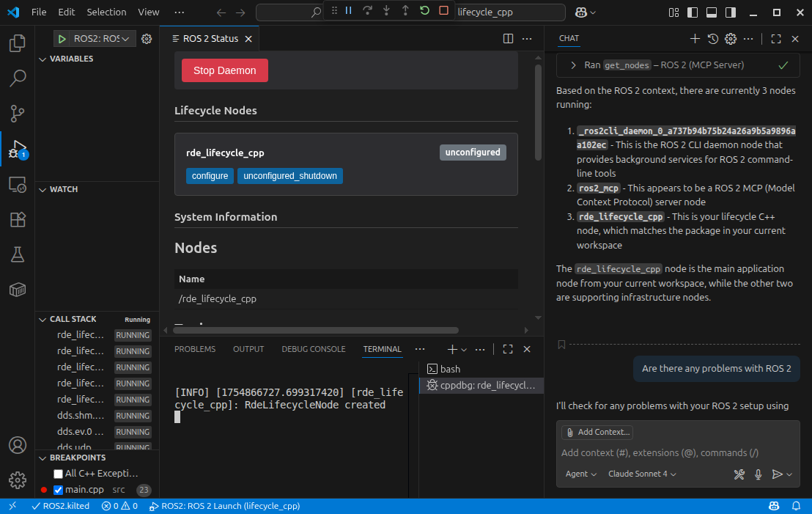

# Robotics Development Extensions for ROS 2
This is a Visual Studio Code Extension that  provides debugging support for [Robot Operating System 2 (ROS 2)](http://ros.org) development ROS 2 on Windows, Linux and MacOS. The Robot Operating System is a trademark of Open Robotics.

## Features

* Automatic ROS environment configuration.
* Allows starting, stopping and viewing the ROS core status.
* Automatically create `colcon` build and test tasks.
* Run and Debug ROS Launch Files
* **Monitor ROS 2 topics in real-time** with the integrated Topic Monitor
* Resolve dependencies with `rosdep` shortcut
* Syntax highlighting for `.msg`, `.urdf` and other ROS files.
* [IntelliSense support for ROS message files](intellisense.md) with hover information showing message properties and go-to-definition
* Automatically add the ROS C++ include and Python import paths.
* Format C++ using the ROS `clang-format` style.
* [Discover and run ROS 2 tests](test-explorer.md) with integrated Test Explorer support
* Debug a single ROS node (C++ or Python) by [attaching to the process](debug-support.md#attach).
* Debug ROS nodes (C++ or Python) [launched from a `.launch` file](debug-support.md#launch).
* Configure C++ and Python IntelliSense for ROS development
* Available for Microsoft Visual Studio Code and Anysphere's Cursor.

## Other Offerings

### URDF / Xacro Editing

Ranch Hand Robotics offers a [URDF and Xacro editor](https://ranchhandrobotics.com/rde-urdf/), which pairs well with this extension

### Robot Developer Extensions for ROS 1
For those working with ROS 1, the [Robot Developer Extensions for ROS 1](https://ranchhandrobotics.com/rde-ros-1/) are available to support you

### Discussions
[Github Discussions](https://github.com/orgs/Ranch-Hand-Robotics/discussions) are provided for community driven general guidance, walkthroughs, or support.

## Sponsor
If you find this extension useful, please consider [sponsoring Ranch Hand Robotics](https://github.com/sponsors/Ranch-Hand-Robotics) to help support the development of this extension and other open source projects.

## Acknowledgements
This extension is rebranded and re-released by Ranch Hand Robotics, founded by the maintainer of the [ms-iot VSCode ROS Extension](https://github.com/ms-iot/vscode-ros) with permission from Microsoft. 

* Andrew Short ([@ajshort](https://github.com/ajshort)), **original author**
* James Giller ([@JamesGiller](https://github.com/JamesGiller))
* PickNikRobotics ([@PickNikRobotics](https://github.com/PickNikRobotics)) for code formatting
* Microsoft ([@ms-iot](https://microsoft.com)) for curating the ms-iot extension
* and the many contributors and users over the years. 